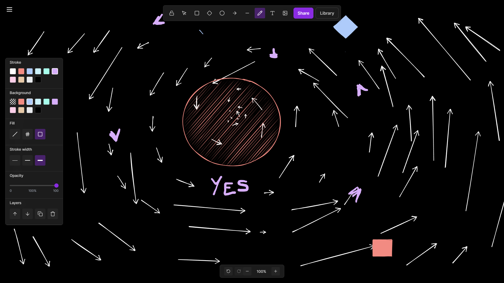

<h1 align="center"> Freehand - Handrawn Diagrams</h1>

**Challenge**: Create an excalidraw clone under 3 hours!

## Libraries Used

Libraries that make the magic happen:

- **Zustand**  
  Handles all the app's state—elements, selections, undo/redo, and more—without breaking a sweat.

- **Rough.js**  
  Draws shapes with that hand-drawn, wobbly look that makes everything feel playful and alive.

- **perfect-freehand**  
  Turns your mouse or stylus scribbles into beautiful, natural-looking freehand lines.

---

Freehand is ready to help you sketch, doodle, and create diagrams with style and speed. If you want to swap out a library or add your own, the codebase is flexible and welcoming!
